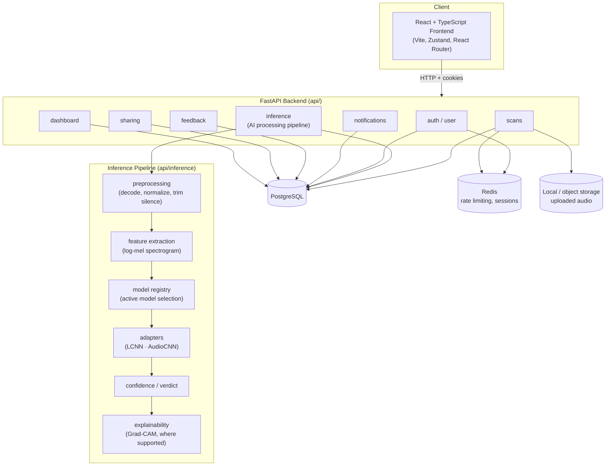

<h1 align="center">🛡️ VoiceGuard</h1>

<p align="center">
  <em>A full-stack platform for detecting AI-generated speech — FastAPI + PostgreSQL + Redis backend,
  a React/TypeScript frontend, and a dual-model (LCNN + AudioCNN) inference pipeline trained on
  ASVspoof 2019.</em>
</p>

<p align="center">
  
  
  
  
  
  
  
  <a href="LICENSE"></a>
</p>

---

## Overview

VoiceGuard answers one question about an uploaded audio clip: **is this real human speech, or is
it AI-generated?** It's built as two things at once:

1. **A product** — a FastAPI backend with account auth, scan upload/management, background AI
   processing, notifications, feedback, sharing, and a usage dashboard, served by a React/TypeScript
   frontend.
2. **A research artifact** — two independently trained detection models (a Light CNN operating on
   log-mel spectrograms, and a second CNN architecture as an alternative), evaluated against the
   ASVspoof 2019 Logical Access benchmark and served through a shared inference pipeline that
   supports hot-swapping the active model.

The final deployed LCNN model reaches **7.07% EER** on the held-out evaluation set (published
LFCC-GMM baseline: 8.09%).

---

## Features

- **Account platform** — email/password auth with verification, session cookies (JWT,
  algorithm-confusion-guarded), password reset, per-route rate limiting.
- **Scan management** — upload an audio clip, track its lifecycle (validating → preprocessing →
  ready → AI analysis → completed/failed) with a full audit trail per scan.
- **Dual-model AI pipeline** — pluggable adapter pattern; the active model (LCNN or a second
  architecture) is chosen at the database level, not hardcoded, so a new architecture can be
  registered and activated without a code change.
- **Explainability** — Grad-CAM attention maps over the mel-spectrogram for architectures that
  support it; a clear "unavailable for this model" response for those that don't, rather than a
  silent wrong answer.
- **Result sharing** — generate a public, token-based read-only link to a scan result.
- **Notifications, feedback, and a usage dashboard** — the rest of the product surface around the
  core detection feature.
- **Security-hardened by default** — every write route is authenticated and rate-limited, bcrypt
  hashing is offloaded off the event loop, uploads are validated by content sniffing (not just
  file extension), and the platform has been through an internal security review and an automated
  DAST regression pass (see [Security Testing](#security-testing)).

---

## Screenshots

> Screenshots aren't checked into this repository yet. Once the frontend is running locally
> (see [Running Locally](#running-locally)), the key screens to capture are: Login/Signup, the
> New Scan upload flow, Scan Processing (live status), Scan Result (verdict + explanation), and
> the Dashboard. Contributions adding real screenshots here are welcome.

---

## Architecture



**Request flow for a scan:** upload → `scans` validates and stores the file → a background job
runs preprocessing → once `READY_FOR_AI`, `POST /scans/{id}/process` hands off to the `inference`
pipeline → the currently-active model (selected via the model registry, not hardcoded) produces a
verdict, confidence score, and — where supported — a Grad-CAM explanation → the result is
persisted and readable via `GET /scans/{id}/result|technical|explanation`.

---

## Tech Stack

| Layer | Technology |
|---|---|
| Backend | FastAPI, SQLAlchemy (async), Alembic migrations, PostgreSQL, Redis, PyJWT, bcrypt |
| Frontend | React 19, TypeScript, Vite, Zustand, React Router, React Hook Form + Zod, Tailwind CSS |
| ML / Inference | PyTorch (CPU), torchaudio, librosa, soundfile — LCNN and a second CNN architecture behind a shared adapter interface |
| Explainability | Grad-CAM (custom implementation) |
| Infra | Docker, Docker Compose |
| Testing | pytest + pytest-asyncio (backend, 191 tests), a custom DAST harness (`automated_test/`), a k6 load-testing harness (`performance/`) |
| CI | GitHub Actions — backend (lint + test + coverage), frontend (lint + typecheck + build), Docker build sanity |

---

## Repository Structure

```
.
├── .github/workflows/       # CI: backend, frontend, docker
├── automated_test/          # DAST regression harness (see Security Testing)
└── voiceguard/
    ├── api/                 # FastAPI backend
    │   ├── core/            # config, database, redis, security, rate limiting, middleware
    │   ├── auth/ user/      # authentication and account management
    │   ├── scans/           # scan upload, lifecycle, state machine
    │   ├── inference/       # AI processing pipeline, model registry, adapters
    │   ├── notifications/ feedback/ sharing/ dashboard/
    │   ├── alembic/         # database migrations
    │   └── tests/           # backend test suite
    ├── frontend/             # React + TypeScript SPA
    ├── src/                  # ML: models (LCNN, AudioCNN, RawNet2), data pipeline, training, explainability
    ├── scripts/               # training / evaluation / benchmarking entry points
    ├── configs/                # model hyperparameter configs
    ├── docs/                    # ML research documentation (problem, dataset, architecture, training, evaluation, explainability, serving, results)
    ├── training/ evaluation/ performance/   # experiment results, benchmark reports, load-test reports
    ├── docker-compose.yml       # full local stack: postgres + redis + backend + frontend
    ├── api/Dockerfile.ml         # backend image (ML-enabled) — what docker-compose builds
    └── Dockerfile                 # standalone inference-server image (legacy /predict path only)
```

---

## Installation

### Prerequisites
- Docker and Docker Compose (recommended path — see below)
- *or*, for running components individually: Python 3.12+, Node.js 20+, PostgreSQL 16, Redis 7

### Clone
```bash
git clone <this-repository-url>
cd AMIT-KRISHNA/voiceguard
```

---

## Docker Setup (recommended)

The full stack — PostgreSQL, Redis, the FastAPI backend, and the Vite dev server for the
frontend — runs with one command from `voiceguard/`:

```bash
docker compose up --build
```

This builds the backend from `api/Dockerfile.ml` (the ML-enabled image — installs
`api/requirements.txt` + `api/requirements-ml.txt`, i.e. the full platform + torch/torchaudio),
runs Alembic migrations automatically on container startup, and starts the frontend dev server
proxying `/api` to the backend container.

- Backend: http://localhost:8000 (Swagger UI at `/docs`)
- Frontend: http://localhost:5173

> **`voiceguard/Dockerfile` (repo root) is currently broken and should not be used.** It predates
> the full platform and only installs `pyproject.toml`'s ML dependencies, not
> `api/requirements.txt` (SQLAlchemy, Redis, Alembic, etc.). Building and running it fails
> immediately with `ModuleNotFoundError: No module named 'sqlalchemy'` — verified directly as part
> of this release audit. Use `docker compose up` (`api/Dockerfile.ml`) for the real platform; see
> `Release_Readiness_Report.md` for the full finding. Fixing or removing this file is a tracked
> known limitation, not yet done.

---

## Environment Variables

Copy the example files and adjust as needed — every value ships with a safe local-development
default:

```bash
cp api/.env.example api/.env
cp frontend/.env.example frontend/.env   # optional; only needed if not using docker-compose
```

Key variables (see `api/.env.example` for the full list with defaults):

| Variable | Purpose |
|---|---|
| `DATABASE_URL` | PostgreSQL connection string |
| `REDIS_URL` | Redis connection string |
| `JWT_SECRET` | Session token signing key — **generate a real one before any non-local deployment**: `openssl rand -hex 32` |
| `AUDIT_IP_SALT` | Salt for hashing IPs in the audit log — same rule as `JWT_SECRET` |
| `COOKIE_SECURE` | Must be `true` outside local HTTP development |
| `RATE_LIMIT_*` | Per-route rate limits (login, register, scan creation, `/predict`, etc.) |
| `MODEL_CHECKPOINT_PATH` | Path to the LCNN checkpoint the AI pipeline loads |
| `HF_MODEL_REPO` *(optional)* | If set, `app.py`/`demo/app.py` pull the checkpoint from this HuggingFace Hub repo instead of the local file — see [ML Models](#ml-models) |

---

## Running Locally

### Full stack (Docker)
See [Docker Setup](#docker-setup-recommended) above.

### Backend only
Run from `voiceguard/` (not from inside `api/`) — the app's imports and Alembic's
`script_location` both assume this as the working directory:
```bash
pip install -r api/requirements.txt -r api/requirements-ml.txt
alembic -c api/alembic.ini upgrade head   # requires DATABASE_URL pointing at a running Postgres
uvicorn api.main:app --reload --port 8000
```

### Frontend only
```bash
cd frontend
npm install
npm run dev
```

### Backend tests
```bash
cd api
pip install -r requirements.txt -r requirements-ml.txt
pytest
```
The suite (191 tests) uses an in-memory SQLite engine and a fake Redis double — no external
services required.

---

## ML Models

Two architectures are trained and can be registered as the active production model:

- **LCNN** — a Light CNN over log-mel spectrograms; the currently deployed default (7.07% EER).
- **AudioCNN** — a second architecture wired through the same adapter interface, for comparison
  (see `training/Benchmark_Comparison.xlsx` and `evaluation/`).
- **RawNet2** — implemented (`src/models/rawnet2.py`) but not currently deployed; see
  `training/RawNet2_*.md` for the feasibility/readiness assessment.

**Checkpoints are not committed to this repository** (`checkpoints/` is gitignored — model weights
don't belong in git history). To run inference, either:

1. **Train your own** — `python scripts/train.py` (reads `configs/lcnn.yaml`; pass `--resume` to
   continue from `checkpoints/last.pt` instead of starting fresh), then point
   `MODEL_CHECKPOINT_PATH` at the resulting `checkpoints/best.pt`, or
2. **Host your own checkpoint on HuggingFace Hub** and set `HF_MODEL_REPO` (and optionally
   `HF_MODEL_FILENAME`, default `lcnn_best.pt`) — `app.py`/`demo/app.py` will download from there
   if no local checkpoint is found.

All `torch.load()` calls in this repository use `weights_only=True` (verified against every
checkpoint file in this project — see `Vulnerability Test Results/security_review.md`, finding
F-01).

---

## API Overview

Full interactive documentation is served at `/docs` (Swagger) and `/redoc` once the backend is
running. Route groups, all under `/api/v1` unless noted:

| Group | Examples |
|---|---|
| `auth` | register, login, logout, refresh, verify-email, forgot/reset-password, OAuth (Google) |
| `user` | profile get/update, change password |
| `scans` | upload, list, get, cancel, delete, status |
| `inference` | process a ready scan, get result / technical detail / explanation, list available models |
| `sharing` | create/revoke a public share link, fetch a shared result (no auth) |
| `notifications` | list, unread count, mark read / mark all read, delete |
| `feedback` | submit (public), list (admin) |
| `dashboard` | aggregate stats, recent scans |
| `/predict` *(legacy, top-level, not under `/api/v1`)* | Single-shot inference without an account — authenticated + rate-limited (see [Security Testing](#security-testing)) |

---

## Performance Benchmarks

From `performance/performance_fix_report.md` (100 virtual users, 60s, real Docker stack —
methodology and full before/after data in that report):

| Metric | Before | After |
|---|---|---|
| Successful requests | 1.25% (19 / 1,517) | 100% (excluding expected 409 duplicate-upload rejections) |
| Average response time | 1,736.9 ms | 176.7 ms (**−89.8%**) |
| P99 response time | 32,340.7 ms | 1,628.8 ms (**−95.0%**) |
| Login success rate | 15.5% | 100% |
| Login average latency | 29.1 s | 323.5 ms |

Root cause: synchronous `bcrypt` password hashing blocking the single asyncio event loop under
load. Fixed by offloading to a thread pool (`asyncio.to_thread`), which then surfaced two
second-order bottlenecks (undersized Postgres/Redis connection pools) fixed with config-only pool
size increases. Full methodology, raw metrics, and the k6 harness itself are in `performance/`.

---

## Security Testing

- **Internal security review** — `Vulnerability Test Results/security_review.md`, covering
  deserialization safety, upload handling, auth/rate-limiting coverage, checkpoint integrity,
  CORS, and more.
- **Automated DAST regression harness** — `automated_test/` — 227 automated checks across 7
  categories (authentication bypass, RBAC matrix, IDOR, token tampering, injection probing, rate
  limiting, hardcoded credentials), run against a live local stack. Current result: **0 findings**.
- **Notable fix**: the legacy `/predict` endpoint previously had no authentication and no rate
  limiting, allowing unlimited unauthenticated CPU-bound inference calls (cost-abuse / DoS). It now
  requires authentication and enforces a per-user rate limit — see the isolated
  `fix(security): protect legacy /predict endpoint...` commit in the git history.

Run the DAST suite yourself against a local stack:
```bash
cd automated_test
python setup_env.py     # provisions test accounts against your running backend
python run_all.py
```

---

## License

[MIT](LICENSE). This project began as a fork of an existing open-source audio deepfake detector
and has been substantially extended (full backend platform, frontend, multi-model inference,
security hardening, load testing). The original author's copyright is retained in `LICENSE`
alongside this project's, per the MIT license's attribution requirement.

---

## Roadmap

- [ ] Register and evaluate RawNet2 as a third selectable model (architecture implemented, not
      yet benchmarked end-to-end against LCNN/AudioCNN — see `training/RawNet2_*.md`)
- [ ] Frontend automated test coverage (currently none — see `CONTRIBUTING.md`)
- [ ] Object-storage backend for uploaded audio (currently local disk via `STORAGE_BACKEND=local`)
- [ ] Rich per-route OpenAPI descriptions
- [ ] Real screenshots in this README

See `Release_Readiness_Report.md` for the full current list of known limitations.

---

## Contributors

Built by [Kanishsenthilkumar](https://github.com/Amit-0000). Contributions welcome — see
`CONTRIBUTING.md`.
